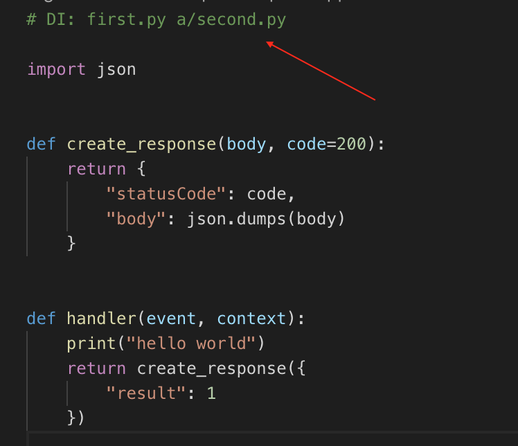

# Rocketsam

A CLI made to build and deploy microservices in AWS (extending AWS SAM).

Currently the project supports lambda written in python 3.6, but can easily be extended to support more languages.

## Why Rocketsam?
Good question, even though there are many third party solutions for deploying and building microservices on AWS, I found that they all lack some basic features.

## Advantages of Rocketsam
* Template per function instead of gigantic template file (the CLI will append to the app skeleton each of the functions template)
* Caching per function, this CLI will upload only functions that their build output has changed (using hash validation).
* The build command support python dependencies (it will be installed using docker and cached in the build folder).
* Seamless deployment of the microservice using Cloud Formation.
* Easy access to API url's and logs of each function using **logs** and **outputs** commands.
* Running a local version of the server using SAM local.

For more info, run rocketsam help

## Getting Started

```
npm install -g rocketsam
```

### Prerequisites

In order to use the CLI, one must install [AWS SAM](https://aws.amazon.com/serverless/sam/), as well as [Docker](https://www.docker.com/) (in order to spin a local server and to install dependencies)

### Folder structure


1. The build folder, contains all of the app's auto generated data
2. the CLI uses the hash folder to detect changes in the code, removing this folder will force rebuilding of the entire microservice.
3. hash of the function 'hello' dependencies
4. hash of the function 'hello' code
5. the Cloud Formation template created by SAM
6. This folder contains all of the functions requirements installed via pip
7. the function 'hello' requirements.
8. the function 'hello' output dir before zipping (contains symlinks to relevant requirements and common folders).
9. the function complete zip (with requirements and everything), the template will use this file as the function code to deploy to AWS.
10. The app code, contains the skeleton template and all of the functions code.
11. The function folder 'hello'
12. The function 'hello' code itself
13. The function requirements file (will install dependencies from here)
14. the function template file, details below
15. the skeleton template, will be copied to the build folder and each function template will be appended to it.
16. The rocketsam config file, details below

## The function template file


The way this template works is that the CLI has special keys: **Name, SammyApiEvent and SammyBucketEvent** which determine the name of the function in the template, an optional api event which called the function and an optional bucket event which trigger the function (if the bucket exist in the microservice and policies allow access). All other keys in the template will imported as is to the function part in the template (marked **[ASIS]**).

* (line 1) The function name in the template and in the AWS cloud
* (line 2) [ASIS] the max time allowed for the function to run
* (line 3-5)[ASIS] env variables available to the function
* (line 6-19) [ASIS] policies for the function
* (line 20-24) rocketsam custom key to state api event
  * (line 21) ignored, in the future will be as additonal indictator to the autorizer.
  * (line 22) if lambda autorizer is, it will use this boolean to determine if the authorizer will be enabled on this function endpoint.
  * (line 23) the endpoint of the function api
  * (line 24) the method used to access the endpoint (GET POST PUT etc...)
* (line 25-32) rocketsam custom key to state bucket event
    * (line 26) the bucket name (stated in the skeleton template)
    * (line 27) the bucket event
    * (line 28 - 32) rules for the event to trigger, imported as is to the resulting bucket event
## The Rocketsam config file


* (line 1) the application dir which will contain the code of the microservice. use '$' to indicate the workspace path
* (line 2) the build dir which the CLI will build to. use '$' to indicate the workspace path
* (line 3) the common dir path. use '$' to indicate the workspace path
* (line 4) the bucket name which will be used to store the functions code (during deploy). must exist beforehand
* (line 5) the stack name used in AWS Cloud Formation

## Other magic
In the app there is a special folder called common (can be defined in the rocketsam config). the files in these folder can be shared across functions using a special syntax placed at the top of the function code file.

For instance:



Will fetch from the common folder two files and placed them in the function resulting zip (can be viewed as symlinks in the function app dir)

The result:


This is not limited to python files only, you can place any files and reference them in the same way.

## License

This project is licensed under the MIT License - see the [LICENSE.md](LICENSE) file for details