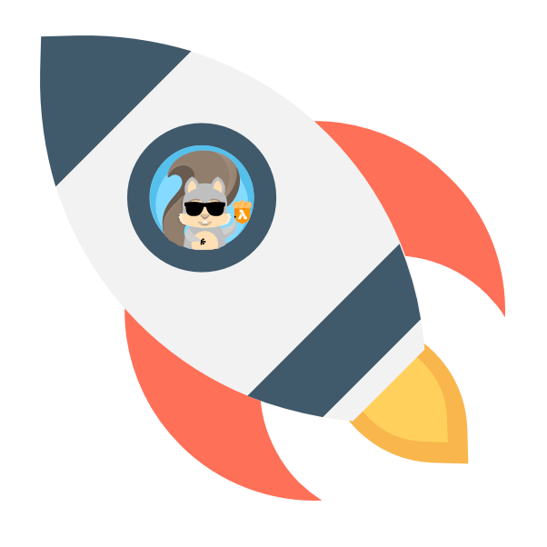
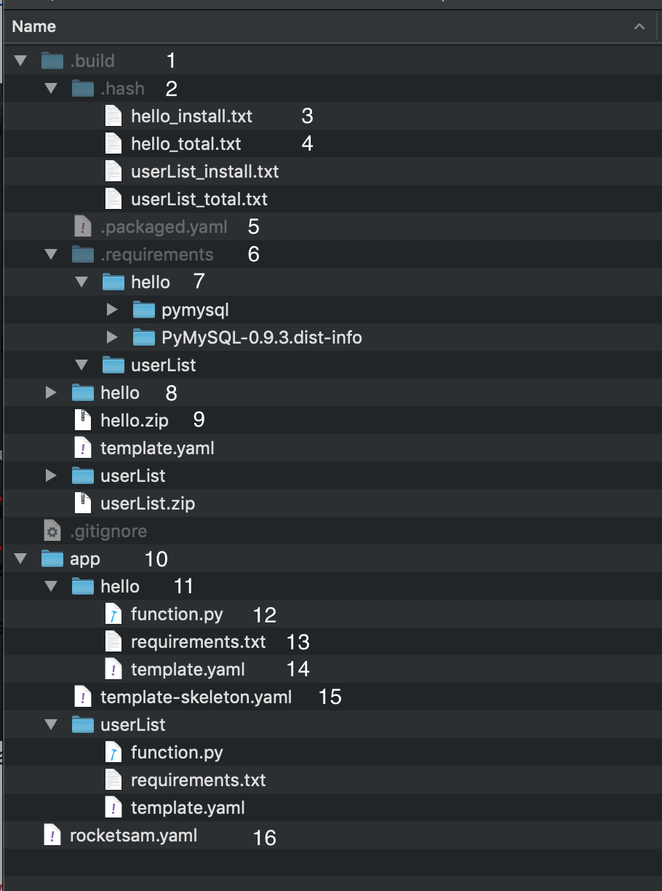
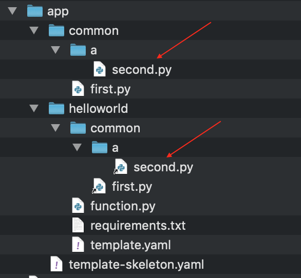

# Rocketsam



A CLI made to build and deploy microservices in AWS.

Currently the project supports lambda written in python 3.6/3.7 or node 8.1, but can easily be extended to support more languages in the future.

## Whats new with v.1.0.18?
Functions are now under a dedicated functions dir inside the app dir (breaking change for projects built with eariler versions).
To upgrade a project, simply create a functions folder inside the app folder, and move all of the functions folders to it.


## Why Rocketsam?
Good question, even though there are many third party solutions for deploying and building microservices on AWS, I found that they all lack some basic features.

## Advantages of Rocketsam
* Template per function instead of gigantic template file (the CLI will append to the app skeleton each of the functions template)
* Caching per function, this CLI will upload only functions that their build output has changed (using hash validation).
* The build command support python/node dependencies (it will be installed using docker and cached in the build folder).
* Seamless deployment of the microservice using Cloud Formation.
* Easy access to API url's and logs of each function using **logs** and **outputs** commands.
* Running a local version of the server using SAM local.

For more info, run rocketsam help

## Getting Started

```
npm install -g rocketsam
```

```bash
# create the project
rocketsam init
# add function to the project
rocketsam create hello
# append api event to the project '/hello' (visible in the function yaml)
rocketsam add event api hello -e /hello
# build all of the functions and creates a SAM template
rocketsam build all
# deploy the stack to AWS
rocketsam deploy

# Get the api url's
rocketsam outputs

# view the logs of hello function as they arrive
rocketsam logs hello
```

### Prerequisites

In order to use the CLI, one must install [AWS SAM](https://aws.amazon.com/serverless/sam/), as well as [Docker](https://www.docker.com/) (in order to spin a local server and to install dependencies)

### Folder structure


1. The build folder, contains all of the app's auto generated data
2. the CLI uses the hash folder to detect changes in the code, removing this folder will force rebuilding of the entire microservice.
3. hash of the function 'hello' dependencies
4. hash of the function 'hello' code
5. the Cloud Formation template created by SAM
6. This folder contains all of the functions requirements installed via pip
7. the function 'hello' requirements.
8. the function 'hello' output dir before zipping (contains symlinks to relevant requirements and common folders).
9. the function complete zip (with requirements and everything), the template will use this file as the function code to deploy to AWS.
10. The app code, contains the skeleton template and all of the functions code.
11. The function folder 'hello'
12. The function 'hello' code itself
13. The function requirements file (will install dependencies from here)
14. the function template file, details below
15. the skeleton template, will be copied to the build folder and each function template will be appended to it.
16. The rocketsam config file, details below

## The function template file
```yaml
# The function name in the template and in the AWS cloud
Name: hello
# [ASIS] the max time allowed for the function to run
Timeout: 10
# [ASIS] The function runtime
Runtime: python3.7
# [ASIS] env variables available to the function
Environment:
  Variables:
    demo: 1
#[ASIS] policies for the function
Policies:
  - Version: '2012-10-17'
    Statement:
      - Effect: Allow
        Action:
          - 's3:*'
        Resource:
          - 'Fn::Sub': 'arn:aws:s3:::${bucketName}/*'
# rocketsam custom key to state api event
SammyApiEvent:
  # If not null, rocketsame will set the authorizer to the one supplied here (must be added to the template)
  authorizerName: MyCognitoAuthorizer
  # the endpoint of the function api
  path: /upload
  # the method used to access the endpoint (GET POST PUT etc...)
  method: post
# rocketsam custom key to state bucket event
SammyBucketEvent:
  # the bucket name (stated in the skeleton template)
  bucketName: MainBucket
  # the bucket event
  bucketEvent: 's3:ObjectCreated:*'
  # rules for the event to trigger, imported as is to the resulting bucket event
  Rules:
    - Name: suffix
      Value: .pdf
    - Name: prefix
      Value: uploads/


```

The way this template works is that the CLI has special keys: **Name, SammyApiEvent and SammyBucketEvent** which determine the name of the function in the template, an optional api event which called the function and an optional bucket event which trigger the function (if the bucket exist in the microservice and policies allow access). All other keys in the template will imported as is to the function part in the template (marked **[ASIS]**).

## The Rocketsam config file
```yaml
# the application dir which will contain the code of the microservice. use '$' to indicate the workspace path
appDir: $/app
# the build dir which the CLI will build to. use '$' to indicate the workspace path
buildDir: $/.build
# the common dir path. use '$' to indicate the workspace path
commonDir: $/app/common
# the bucket name which will be used to store the functions code (during deploy). must exist beforehand (rocketsam init has the option to create a new bucket)
storageBucketName: SampleBucket
# the stack name used in AWS Cloud Formation
stackName: ABCD
# the stack region
region: eu-west-1
```

## Other magic
In the app there is a special folder called common (can be defined in the rocketsam config). the files in these folder can be shared across functions using a special syntax placed at the top of the function code file.

For instance:


Will fetch from the common folder two files and placed them in the function resulting zip (can be viewed as symlinks in the function app dir)

The result:



This is not limited to python/node files only, you can place any files and reference them in the same way.

## License

This project is licensed under the MIT License - see the [LICENSE.md](LICENSE) file for details